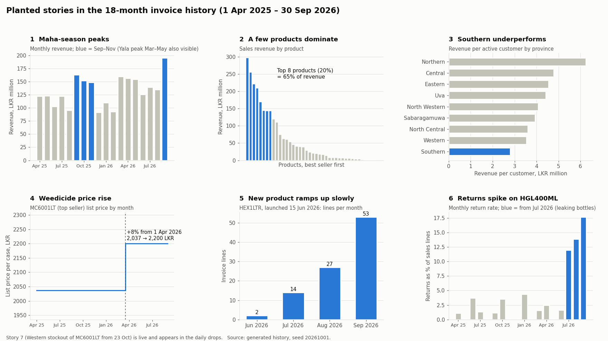

# Story sheet (v2 — for sponsor review)

Stories are planted in the generated data so we know the right answers in advance. The answer key (`genie/answer_key.csv`) is computed from these.

**Single source of truth: `src/sales_insights/generator/stories.py`.** Change a story there, re-run the generators, and the data and answer key follow.

## The business

Modelled on the company's reference SAP order-to-cash extract: a Sri Lankan company selling crop-protection chemicals (company code 2010: weedicides, insecticides, fungicides, sprayers, seedling trays) plus building-solution systems and services (company code 4010). Currency LKR. Fiscal year April–March, labelled by its start year. Customer, rep and product names are fictional; code lists follow the reference.

## Master data (`generator/masters.py`)

| Master | Size | Notes |
|---|---|---|
| Regions | 25 districts → 9 provinces | SAP region code = district, as in the reference |
| Cities | 84 canonical names | Used by silver to fix spelling variants |
| Customers | 600 (+12 duplicate rows as dirt) | 6 customer groups; General Trade, Export Sales, Modern Trade (supermarket chains share a payer) |
| Products | 40 | Reference material IDs and groups, plus 8 new products launched inside the history window |
| Sales offices / reps | 11 offices, 36 reps | One office per province, two in Western and Southern |
| Lookups | companies, plants, storage locations, channels, divisions, customer groups, product groups, product types | |

History: 18 months of invoice lines ending **yesterday** (~43,000 lines, `generator/history.py`, see `invoice_data.md`). Daily drops continue from today.

## Planted stories

| # | Story | Setting | Where it shows |
|---|---|---|---|
| 1 | Demand peaks before the **Maha** (Sep–Nov) and **Yala** (Mar–May) cultivation seasons | Seasonal curve in history generator | History + live days |
| 2 | A few products bring most revenue (80/20) | `POPULARITY_SKEW = 1.1` | History |
| 3 | **Southern** province steadily underperforms (weakest revenue per customer, roughly 35% below the others: fewer distributors plus lower order frequency). **Northern** is the strongest, as in the reference where one Jaffna wholesaler dominates | Demand × 0.85 | History |
| 4 | **Weedicide** (`2CHE06`) price rise: revenue up, units down | +8% from 1 Apr 2026 (start of FY2026) | History |
| 5 | New product **HEX FUNGICIDE 1LTR** (`HEX1LTR`) ramps up slowly | Launch 15 Jun 2026 | History |
| 6 | Returns spike on **HGL INSECTICIDE 400ML** (`HGL400ML`): leaking bottles | From 1 Jul 2026 | History (return credit memos) |
| 7 | **Live:** top seller **MC600 WEEDICIDE 1LTR** (`MC6001LT`) out of stock in **Western** province | From 23 Oct 2026 | Live days: alert, insights job and Genie catch it in demo week |

## Dirt injected on purpose (every row logged in the manifest)

### In master files (built now)

| Dirt | Rate | Silver must |
|---|---|---|
| City spelling variants (`COLOMBO - 10`, `Colombo 10`, `ANURADHAPURA.`, `colombo 09`) — same styles as the reference | 10% of customers | Map to the canonical name in `cities.csv` |
| Blank region code | 3% | Derive from the city |
| Blank customer group | 15% | Set to "Unassigned" |
| Trailing spaces in customer name | 2% | Trim |
| Same customer twice (older version, older timestamp) | 2% | Keep the latest `last_updated_timestamp` |
| Customer ID without leading zeros (`1001591` vs `0001001591`) | 1% | Left-pad to 10 digits |
| Blank product group | 5% of products | Fill from product family or "Unassigned" |
| Mixed-case product description | 8% of products | Upper-case |

### In daily files (`generator/dirt.py`, `generator/simulate.py`, `drip/drip.py`)

| Dirt | Rate / schedule | Silver must |
|---|---|---|
| Duplicate lines (exact copies) | 1.5% of order lines, 1% of change lines | Dedupe on `invoice_number` + `invoice_item` |
| Late invoices (dated 1–7 days before arrival) | ~3% of live invoices | Load into the right `invoice_date`; rebuild those gold dates |
| Returns, cancellations, price corrections against older invoices | every day | MERGE: latest change wins |
| City spelling variants | 5% of order lines | Map to `cities.csv` |
| Blank `sales_office` / `plant` / `storage_location` / `customer_group` / `product_group` | 2% of order lines | Fill from master data |
| Invalid `invoice_date` (`01/10/2026`, `2026-13-05`, `0000-00-00`) or negative quantity on a `ZAOR` | 0.4% of order lines | Quarantine with a reason |
| Same file delivered twice | Every Monday, Sunday's orders file again (same name) | Load once (exactly-once ingestion) |
| Missing day | 18 Oct arrives on 19 Oct | Catch up; nothing lost |
| New column `sales_rep_id` | From 22 Oct | Schema evolution, no failure |

## Open decisions

- [ ] Sponsor approves the business setting and stories
- [ ] Confirm attach-rate definition (see `kpi_definitions.md`)

